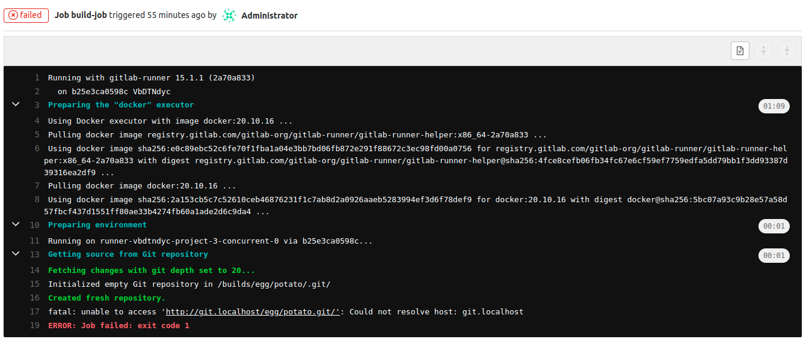
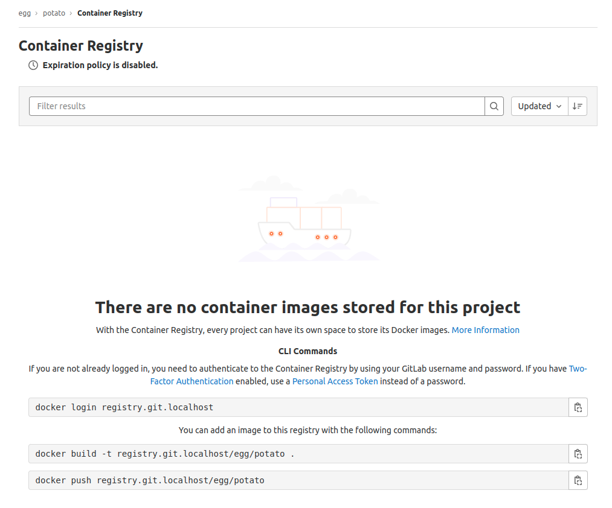
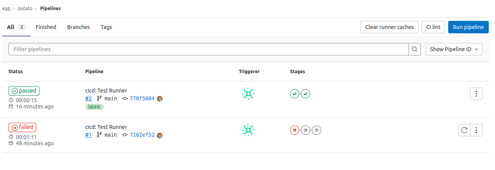

A self-managed gitlab instance at my localhost.
===

> `how-I-did`.

### > Tools

- Using `docker compose` to manage the services.

### > Services

- GitLab Instance (of course)
- GitLab Runner

> Runner is like a machine that can run jobs.

---

## Clone and start the services

```bash
git clone {this project}
cd {this project}
export GITLAB_HOME=$(pwd)
docker compose up -d
```

### > Check the GitLab instance is healthy

```bash
docker-compose exec gitlab /bin/bash -c "gitlab-ctl status"

# OR

watch -n 1 docker compose ps
```

---

## Configure the gitlab instance for the first time

### > Getting the root password
```bash
docker exec -it gitlab-ce cat /etc/initial_root_password
```

### > Sign in @ [localhost]()

username: root

password: [root-password]

### > Change the admin credentials
- Change the username root to something else
- Change the password to something else

### > Create a new project for whatever you want
...

---

## Register a Gitlab Runner:

```bash
docker exec -it gitlab-runner gitlab-runner register
```

`gitlab-ce` is the _container_name_ of the gitlab instance - see in [compose](./docker-compose.yml#L8) file #L8

> host: http://gitlab-ce 

Two types of tokens for runners
- Shared runner
- Project-specific runner
> token: `token`

> Runner name: `anything`

you will need to use these tags in your job stages
> tags: `whatever` 

> description: `whatever`

> executor: `docker`

See the services tag in [gitlab-ci.yml](.gitlab-ci.yml)

I am going to use dind (docker in docker) so set the image
> docker-image: `docker:20.10.16`

We are using DIND so we need to set the flags 
- privileged (runner with full access)
- network_mode (to see gitlab-instance from gitlab-runner DIND)

Otherwise, CI will fail like this


> `privileged = true`

> `network_mode = "gitlab-network"`

see in [compose](./docker-compose.yml#L38) file #L38 [ci-file](sample-gitlab-runner.config.toml#L47)

> After registering the runner, you need to set the var `privileged = false`
---

Container Registry


Check to login into the registry
```bash
docker login -u {username} -p {password} registry.git.localhost
```

CI PASSING

